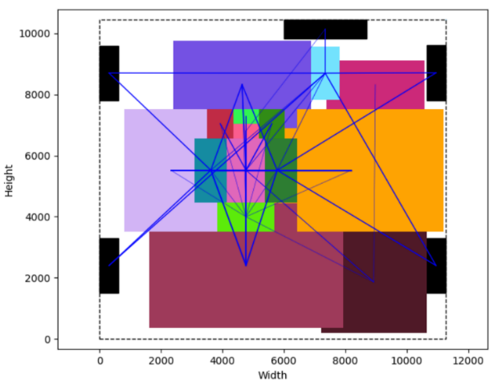
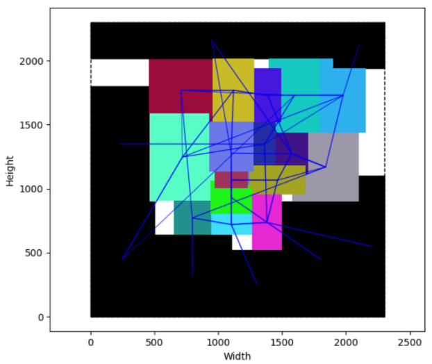
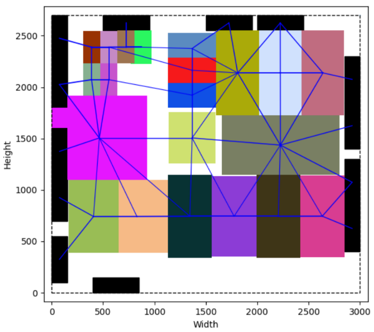

# Fixed-Outline With Rectilinear Soft Blocks
Usage
---
compliation : `make` 

command-line : `./floorplanner <INPUT> <OUTPUT>` 

Notice
---
The `Point` structure uses `double` to store the values `(y, x)`. If you need to handle larger cases, please modify it to use `int` or another datatype that avoids floating-point computation.

Performance
---
This program has won first place in the 2023 ICCAD contest. The following table shows the execution time and the corresponding performance.

| Test Case | Execution Time (s) | HPWL |
|-----------|---------------------|-------------|
| Case 1    | 477.899             | 143,469,196.0    |
| Case 2    | 348.393             | 17,506,951.5     |
| Case 3    | 1029.149            | 1,808,593.5      |
| Case 4    | 753.206             | 57,128,650.0     |
| Case 5    | 450.552	          | 15,087,250.0     |
| Case 6    | 705.498	          | 34,344,100.0     |
| Case 7    | 440.066             | 371,460,550.0    |
| Case 8    | 1407.624            | 94,659,900.0     |
| Case 9    | 448.264             | 81,583,750.0     |
| Case 10   | 197.851             | 17,538,150.0     |

The hidden testcases (case 7~10) can be found in https://www.iccad-contest.org/2023/tw/03_problems.html.

Result Visulization
---

Further Detail
---
If you are interested in implementation details, you may refer to the [Fixed-Outline With Rectilinear Soft Blocks Report](./doc/Fixed-Outline%20With%20Rectilinear%20Soft%20Blocks%20Report.pdf) (written in Mandarin).